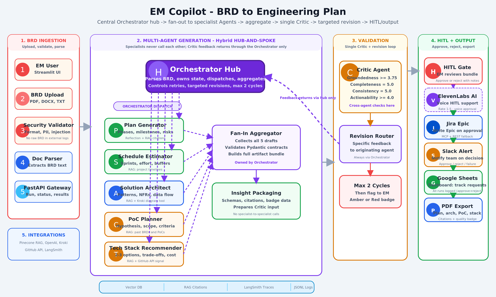

# EM Copilot: BRD to Engineering Plan Agent (Demo)

[](https://python.org)
[](https://github.com/langchain-ai/langgraph)
[](https://pinecone.io)
[](https://smith.langchain.com)
[](https://streamlit.io)
[](https://www.atlassian.com/software/jira)
[](https://elevenlabs.io)
[](LICENSE)

> A demo of **EM Copilot**: a production-grade, 7-Agents LangGraph system, grounded with RAG that transforms a raw Business Requirements Document (BRD) into an draft of engineering package: Structured plan, Project schedule, Architecture diagram, PoC definition, and Tech Stack options. Outputs are evaluated by a Critic Agent after passing quality grade, downloadable as PDF, reviewed via a Human-in-the-Loop (HITL) gate supporting voice commands, and deployed to Jira Cloud, Dashboard in Google Sheets, and Slack alert.

🔗 **Live Demo:** [huggingface.co/spaces/rganbote/em-copilot](https://huggingface.co/spaces/rganbote/em-copilot)  

---

## The Problem

Engineering Managers face a persistent bottleneck translating complex BRDs into structured technical plans, schedules, and architecture diagrams. This manual process is time-consuming and produces inconsistent results:

- **Delivery delays**: Weeks spent drafting sprint scopes and mapping timelines
- **Misalignment**: Gaps between business intent and engineering implementation
- **Inconsistent scoping**: Ad-hoc architectures and planning criteria varying across squads
- **Org specific Tech stack**: Exploring tech stack to, what is allowed or available vs not support in your org level infrastructure

## The Solution

EM Copilot ingests a raw BRD and produces a complete, audit-ready engineering bundle in under ~60 seconds. The system combines RAG-grounded specialist agents with a self-correcting Critic loop and human approval gate, so outputs carry a clear Green / Amber / Red quality badge before anything reaches Jira or Google Sheets.

---

## Engineering Highlights

- **7-Agent LangGraph pipeline**: Hybrid Hub & Spoke design pattern. Parallel dispatch to specialist Agents, ~3× faster than sequential chaining (~50s vs >2.5 min)
- **Pydantic-enforced output contracts**: At every agent boundary, zero untyped LLM handoffs
- **Deterministic security layer** 7-check sequential pipeline (format, size, word count, regex injection guard, semantic injection guard, PII redaction, completeness check)
- **Pinecone RAG**: Each specialist agent retrieves org-specific standards with citation tracking; Critic enforces that citations match valid vector chunks
- **LLM-as-Judge Critic with 3 deterministic failure-mode caps**: Prevents the Critic from being overly optimistic; Hallucination guard, uncited claim cap, sentinel fallback cap
- **Targeted revision loop**: Critic flags only the specialist agents that failed; only those re-run (max 2 cycles), not the full pipeline
- **ElevenLabs Voice HITL Gate**: Conversational human approval accepting numeric ratings and natural language feedback via webhook
- **Jira Epic via MCP**: uses `mcp-atlassian` MCP server (stdio transport) with automatic fallback to REST API; Epic description built in Atlassian Document Format (ADF)
- **5-method evaluation framework**: Rule-based, LLM-as-Judge, execution/schema, BERTScore semantic diff, Human HITL ratings
- **LangSmith full-trace observability**: Every model call, token count, prompt, and latency captured

---

## Challenges & Lessons Learned

Building a production-grade Multi-Agent system surfaces problems that PoC demos may not.

**1. Data strategy & Golden datasets**: Challenging to come up with Agent contracts. Needed thorough analysis on schemas & who consumes what. Output quality is only as good as your Golden dataset. Lesson: Create your domain specific and your org standard data. Define Pydantic for BRD structure at the org level. Define maintain versioning of a Golden dataset.

**2. Modular vs. Functional design**: Vibe coding tends to miss extensibility. Refactoring in mid-project was expensive. Lesson: Give the AI your architectural vision and extensibility requirements explicitly for future scope of work, not just the task or feature spec.

**3. Reliable AI**: Less Bells and whistles but more reliable AI will give more adoption. Lesson: Early versions had more integrations but lower output reliability. Cutting scope to harden the Critic, Eval methods, and security layer produced a more reliable system.

**4. Guardrails**: LLM judges are optimistic by default. Autonomous components need deterministic guardrails wrapped around them, not embedded inside them. The Critic was passing outputs it shouldn't have. Lesson: Added 4 deterministic rules e.g. BERTScore in Eval framework.

**5. Safety & Security**: Security check to prevent prompt ingestion; BRD validation for schema compliance. . Asking Agents to "cite sources" for grounding is not enough. The Critic must verify the citation maps to a real vector chunk key. Lesson: Design citation verification into the evaluation.

**6. Responsible AI**: Autonomous Agent requires mindset shift. Hallucation detection requires active enforcements & guardrails. But a LLM judge you can't deterministically override, is a liability rather than a feature. Lesson: Nothing exports without a human approval gate. Jira write upon approval.

**7. Observability from Day 1**: Silent failures or degradation due to drift likely to happen in Production. Monitoring the Drift, you should catch before customer. LangSmith was added mid-project and immediately surfaced latency issues and prompt failures that were invisible before. Lesson: LangSmith or cheaper telemetry is required from the begining. You can't fix what you can't see.

**8. Cost & Token usage**: The price you pay for that observability is real. LangSmith billing scales with traces, so a production deployment at scale would sample LangSmith for new releases and Red-flagged runs, while letting the existing JSONL logger handle the routine firehose.

**9. Latency is Product problem not just an engineering one**: 50 seconds felt fast during development. Users expect faster. Lessons: Optimize the whole orchestration/workflow. Cache Prompt and Output. Parallel dispatch was the biggest single win (~3× speedup).

**10. Conversational AI & HITL**: ElevenLabs is easy to configure but getting the Voice AI Agent to correctly interpret artifact summaries required to pass structured context into the pipeline is harder. Lesson: budget more time for voice integration.

---

## What This Demo Shows

| Area | What You Can See |
|---|---|
| System Architecture | 7-agent design, parallel dispatch, Critic loop, HITL gate |
| Security Pipeline | 7-check deterministic validation layer before any LLM call |
| Agent Roles | Each agent's responsibility, input/output contract, design pattern |
| Evaluation Framework | 5-method eval with v0→v1 benchmark improvement data |
| Sample Input/Output | Realistic BRD → full engineering plan + task breakdown |
| Mock Demo Code | Pipeline structure and data contracts without real prompts |
| Cost Analysis | Token breakdown and cost per pipeline run (~$0.31/run) |

---

## System Architecture



The diagram shows the full LangGraph hub-and-spoke pipeline: security layer → orchestrator hub → threaded fan-out to 5 parallel specialist agents → Pydantic fan-in → Critic (LLM-judge + FM caps) → decision router → HITL gate → downstream integrations. See [diagrams/README.md](diagrams/README.md) for node-by-node annotation.

---

## Screenshots

| Streamlit UI — Pipeline Complete | HITL Voice Gate (ElevenLabs) |
|---|---|
|  |  |

| LangSmith Trace — Node Execution | Kroki-Rendered Architecture Diagram |
|---|---|
|  |  |

| LangSmith Monitoring | LangSmith Cost & Tokens |
|---|---|
|  |  |

See [screenshots/README.md](screenshots/README.md) for full annotations on each.

---

## Agent Inventory

| Agent | Role | Pattern |
|---|---|---|
| **Orchestrator** | Parses BRD sections, routes to specialists | Hub-and-spoke dispatcher |
| **Plan Generator** | Creates phased engineering plan with milestones | RAG + Reflection |
| **Schedule Estimator** | Estimates effort, sprint timeline, dependencies | RAG + Timeline modeling |
| **Solution Architect** | Generates Mermaid diagram rendered via Kroki | RAG + Diagram synthesis |
| **PoC Planner** | Defines proof-of-concept scope and success metrics | RAG + Scoping |
| **Tech Stack Recommender** | Evaluates technology options against org standards | RAG + Org standards |
| **Critic Agent** | Quality auditing, revision loop control, Rule-based + BERTScore  | LLM-as-Judge |

---

## Evaluation Results (v0 → v1)

| Dimension | v0 (Initial) | v1 (Post-Critic) | Delta |
|---|---|---|---|
| Groundedness | 2.40 | 3.90 | +1.50 |
| Completeness | 3.80 | 4.80 | +1.00 |
| Consistency | 4.10 | 4.60 | +0.50 |
| Actionability | 3.20 | 4.00 | +0.80 |
| **Overall** | **3.38 / 5.00 🟡** | **4.33 / 5.00 🟢** | **+0.95** |

---

## Cost Per Pipeline Run

| Agent | Model | Est. Cost |
|---|---|---|
| Security + Orchestrator + Critic | gpt-4o-mini | ~$0.003 |
| Plan Generator | gpt-4o | ~$0.063 |
| Schedule Estimator | gpt-4o | ~$0.043 |
| Solution Architect | gpt-4o | ~$0.075 |
| PoC Planner | gpt-4o | ~$0.043 |
| Tech Stack Recommender | gpt-4o | ~$0.043 |
| **Total per run** | | **~$0.31** |

---

## Repo Structure

```
engineering-plan-agent-demo/
├── README.md
├── docs/
│   ├── architecture.md              # 7-agent system design and patterns
│   ├── system-flow.md               # Step-by-step pipeline walkthrough
│   ├── agent-roles.md               # Agent responsibilities and contracts
│   └── security-and-sanitization.md # What's protected and why
├── diagrams/
│   ├── README.md                    # Mermaid source for all diagrams
│   ├── high-level-architecture.png
│   └── multi-agent-flow.png
├── screenshots/
│   ├── input-brd.png
│   ├── generated-plan.png
│   └── review-output.png
├── samples/
│   ├── sample-brd.md                # Realistic BRD input
│   ├── sample-engineering-plan.md   # Full generated plan output
│   └── sample-task-breakdown.md     # Task breakdown by engineering domain
├── demo/
│   ├── mock_agent_runner.py         # Simulated 7-agent pipeline (no real prompts)
│   └── sanitized_example.py        # End-to-end CLI walkthrough
└── LICENSE
```

---

## Quick Start — Run the Demo

```bash
git clone https://github.com/rahulganbote/engineering-plan-agent-demo.git
cd engineering-plan-agent-demo
python demo/sanitized_example.py            # formatted output
python demo/sanitized_example.py --verbose  # include task detail
python demo/sanitized_example.py --json     # raw JSON output
```

No API keys required. The demo runs the pipeline structure over mock data.

---

## Tech Stack

LangGraph · GPT-4o · GPT-4o-mini · Pinecone · LangSmith · FastAPI · Streamlit · ElevenLabs · Jira MCP (mcp-atlassian) · Google Sheets (gspread) · ReportLab · Kroki · Pydantic · BERTScore · Tenacity · Slack

---

## Note on Completeness

This is a only **demo repo**. The full system — Agent prompts, LangGraph orchestration, RAG ingestion pipeline, Critic revision logic, evaluation framework, and all integration code is in a private repository.

This repo is designed to give EM, TPMs and engineers a clear picture of system design, output quality, and engineering judgment. The implementation is protected.

🔒 **Private Repo:** [github.com/rahulganbote/engineering-plan-agent](https://github.com/rahulganbote/engineering-plan-agent)

If you want to discuss the full system in a technical interview, I'm happy to walk through it.

---

## Pending Work and Future Enhancements
- Multi-Model system and output
- TBD

---

## 📜 License
MIT License - Feel free to use this project for learning and inspiration only.

---

## 🧑‍💻 Author

**Rahul Ganbote** — [LinkedIn](https://www.linkedin.com/in/rahul-ganbote-040a7b/) · [GitHub @rahulganbote](https://github.com/rahulganbote)

---

*© 2026 Rahul Ganbote · All rights reserved.*
