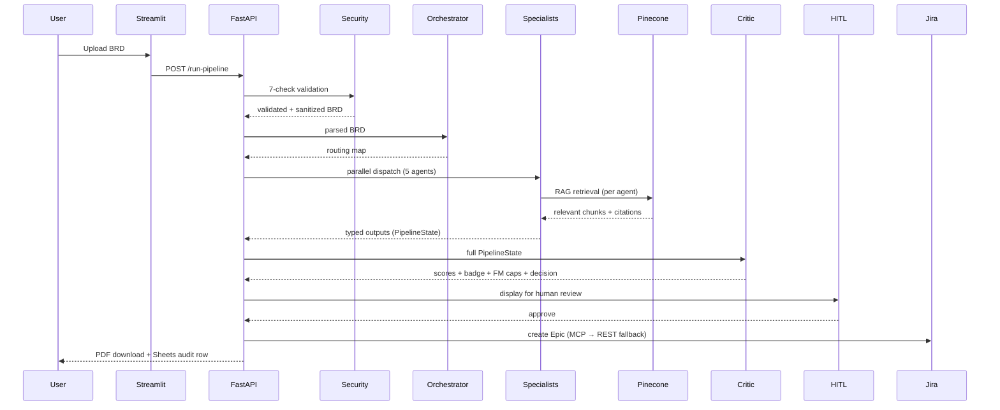

# Diagrams

Architecture and flow diagrams for EM Copilot.

## LangGraph Pipeline Flow Diagram


This is the actual architecture diagram showing:
- **Deterministic Security Layer** — 7 checks before any LLM node runs
- **`node_orchestrator_hub`** — BRD parsing and section routing
- **`node_dispatch_specialists`** — Threaded Fan-Out via `ThreadPoolExecutor` (5 agents in parallel)
- **5 Specialist Agents** — RAG-grounded, Pydantic output contracts
- **`node_aggregate_outputs`** — Pydantic Fan-In collecting all specialist results
- **`node_critic`** — LLM-judge over 4 dimensions + FM-1/2/3 deterministic caps
- **`node_decision_router`** — routes to HITL gate, targeted revision loop, or error node
- **`await_hitl`** — LangGraph interrupt/pause point for human review
- **HITL Gate** — ElevenLabs Voice or UI button approval
- **Downstream** — ReportLab PDF, Pinecone KB ingest, Jira Cloud MCP, Google Sheets export

Node names shown (`node_orchestrator_hub`, `node_dispatch_specialists`, etc.) are the LangGraph graph node identifiers — these reflect the pipeline structure but do not include prompts or orchestration logic.

---
## Architectural Overview

```
                         ┌─────────────────────────────────────────────────┐
                         │         SECURITY VALIDATION LAYER               │
BRD Upload ──► FastAPI──►│  File check → Parse → Injection Guard (regex)   │
(Streamlit)     POST     │  → Injection Guard (LLM) → PII Redact → BRD ✓   │
            run-pipeline └─────────────────────────────────────────────────┘
                                              │ validated BRD text
                                              ▼
                                    Orchestrator Agent
                                    (hub — parses, routes sections)
                                              │
                                              ▼
            ┌─────────────────────────────────────────────────────────────────────────┐
            │ ThreadPoolExecutor │ (parallel dispatch) │             │                │
            ▼                    ▼                     ▼             ▼                ▼
    Plan Generator    Schedule Estimator  Solution Architect  PoC Planner  Tech Stack Recommender
    (RAG + Reflect)   (RAG + Timelines)   (RAG + Diagram)   (RAG + Timelines) (RAG + Org Stds)
            │                     │    (Mermaid+Kroki) │                 │           │ 
            ▼                     ▼                    ▼                 ▼           ▼ 
            └─────────────────────└────────────────────────┘─────────────────└───────────┘
                                    │                       
                                    ▼       ◄──── all 5 outputs together  
                             Critic Agent  
                            (LLM-as-judge + FM-1/2/3 caps)
                                    │
                     ┌──────────────┴───────────────┐
                     │  score < threshold?          │
                     │  revision_count < 2?         │
                     ▼ yes                          ▼ no
              ↻ Targeted revision           HITL Approval Gate
              (only flagged Agents)         (Button OR Voice via ElevenLabs)
                                                    │
                        ┌───────────────────────────┼───────────────────────────┐
                        │                           │                           │
                        ▼ Approved                  ▼ Rejected                  ▼
          Sheets + Jira Epic (MCP) + Pinecone   Sheets audit row only              (wait)
```

## Multi Agent Flow — Mermaid source



## Rendering Options

**GitHub** renders Mermaid natively in Markdown — paste the code blocks into any `.md` file.

**Excalidraw / draw.io** — use for polished PNG exports.

**CLI render:**
```bash
npx @mermaid-js/mermaid-cli -i diagrams/architecture.mmd -o diagrams/high-level-architecture.png
```
