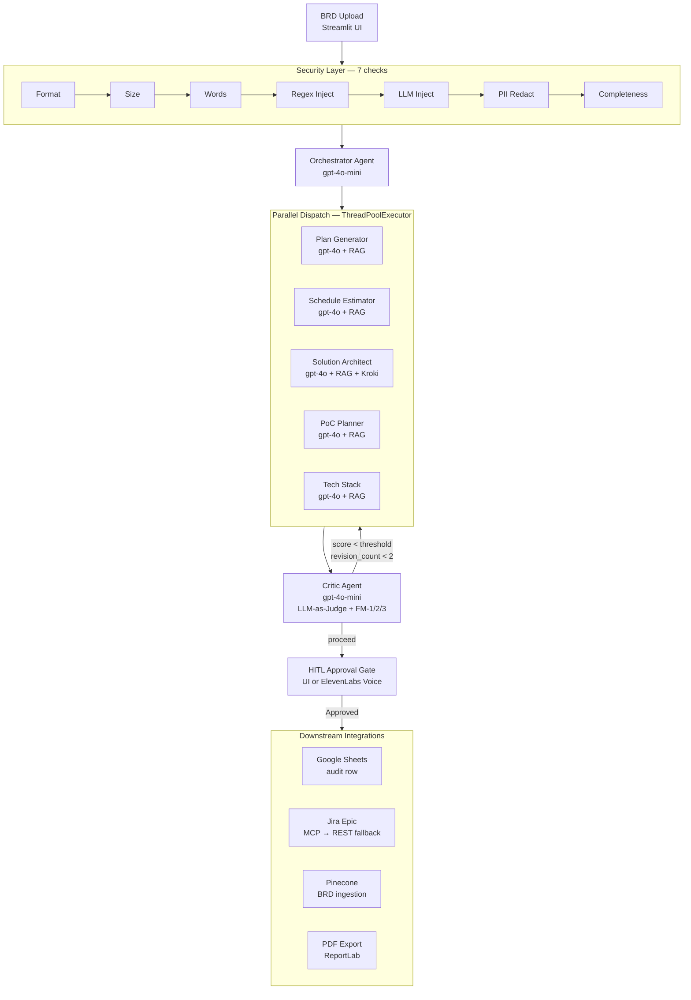
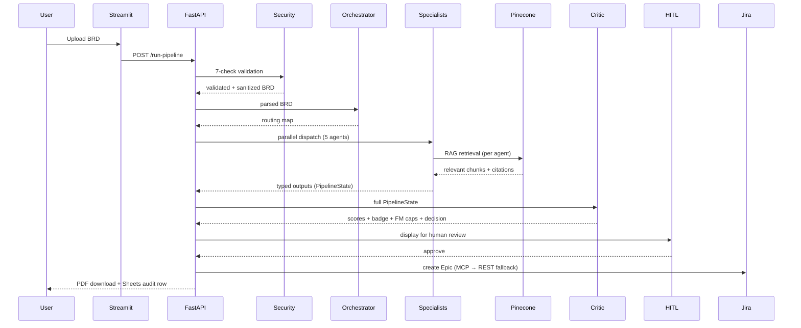

# Diagrams

Architecture and flow diagrams for EM Copilot.

## architecture_hub_spoke_v3.svg — LangGraph Pipeline (Hub-and-Spoke)


This is the actual architecture diagram showing:
- **Deterministic Security Layer** — 7 checks before any LLM node runs
- **`node_orchestrator_hub`** — BRD parsing and section routing
- **`node_dispatch_specialists`** — Threaded Fan-Out via `ThreadPoolExecutor` (5 agents in parallel)
- **5 Specialist Agents** — RAG-grounded, Pydantic output contracts
- **`node_aggregate_outputs`** — Pydantic Fan-In collecting all specialist results
- **`node_critic`** — LLM-judge over 4 dimensions + FM-1/2/3 deterministic caps
- **`node_decision_router`** — routes to HITL gate, targeted revision loop, or error node
- **`await_hitl`** — LangGraph interrupt/pause point for human review
- **HITL Gate** — ElevenLabs Voice or UI button approval
- **Downstream** — ReportLab PDF, Pinecone KB ingest, Jira Cloud MCP, Google Sheets export

Node names shown (`node_orchestrator_hub`, `node_dispatch_specialists`, etc.) are the LangGraph graph node identifiers — these reflect the pipeline structure but do not include prompts or orchestration logic.

---

## high-level-architecture.png — Mermaid source



## multi-agent-flow.png



## Rendering Options

**GitHub** renders Mermaid natively in Markdown — paste the code blocks into any `.md` file.

**Excalidraw / draw.io** — use for polished PNG exports.

**CLI render:**
```bash
npx @mermaid-js/mermaid-cli -i diagrams/architecture.mmd -o diagrams/high-level-architecture.png
```
