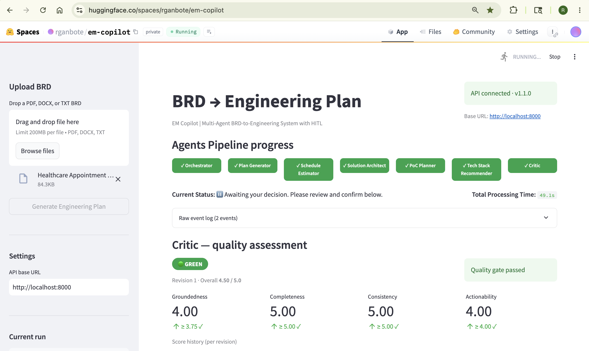
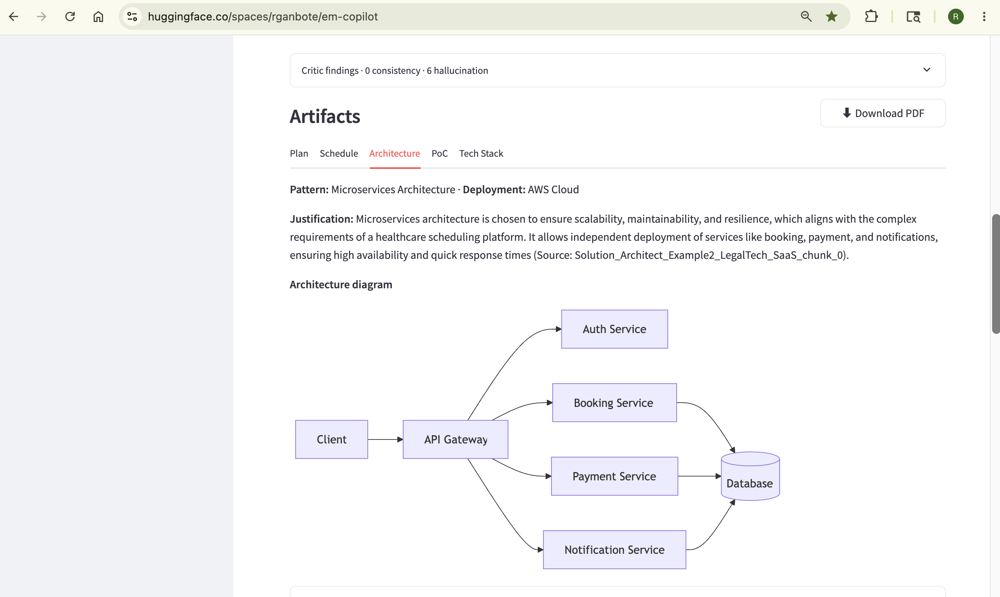
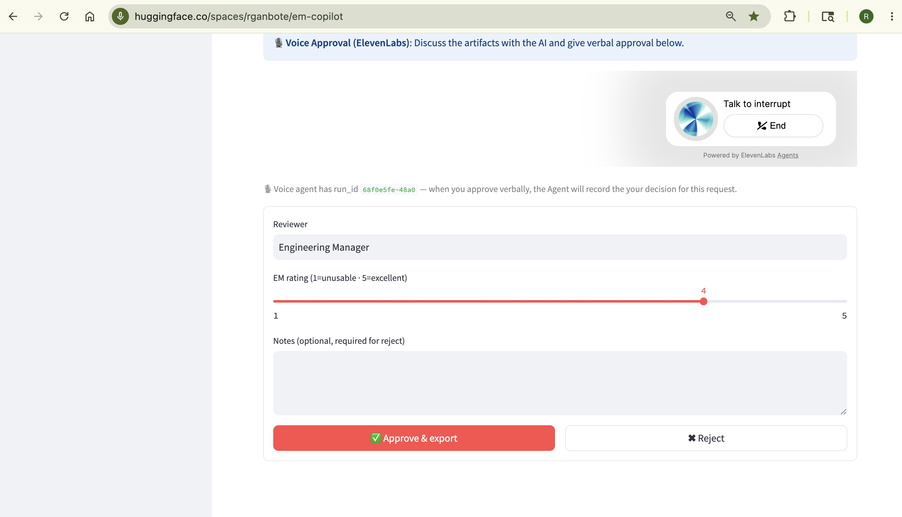
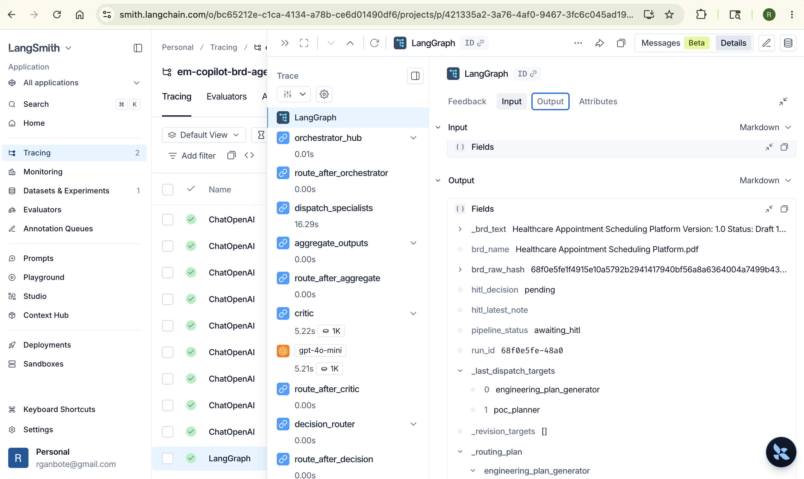
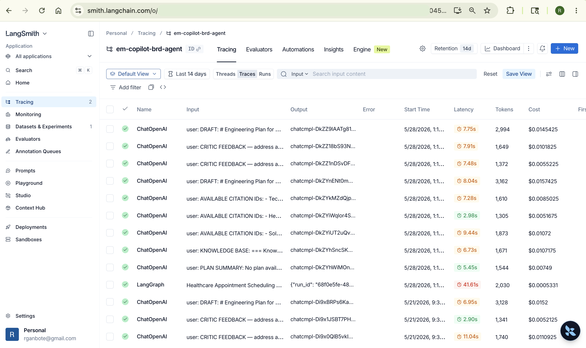
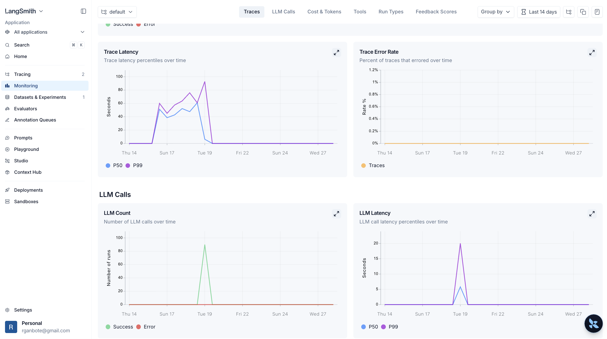
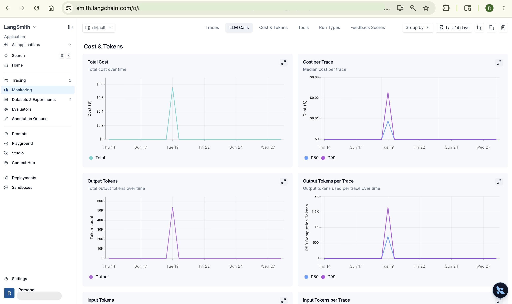

# Screenshots

Live screenshots from the deployed EM Copilot system at [huggingface.co/spaces/rganbote/em-copilot](https://huggingface.co/spaces/rganbote/em-copilot) and LangSmith telemetry.

---

### 01 — Streamlit UI: Pipeline Complete, Critic GREEN

All 7 agent badges green (✓ Orchestrator · ✓ Plan Generator · ✓ Schedule Estimator · ✓ Solution Architect · ✓ PoC Planner · ✓ Tech Stack Recommender · ✓ Critic). Critic quality assessment: **GREEN 4.50 / 5.0**, Quality gate passed. Total processing time: **49.1s**.

---

### 02 — Streamlit UI: Generated Architecture Diagram (Kroki SVG)

Architecture tab showing the Kroki-rendered Mermaid SVG for a healthcare appointment scheduling platform: Microservices pattern · AWS Cloud deployment. Plan / Schedule / Architecture / PoC / Tech Stack tabs. Download PDF button.

---

### 03 — HITL Voice Gate: ElevenLabs Approval

Human-in-the-Loop approval gate. ElevenLabs Conversational AI widget ("Talk to interrupt") active alongside the UI form. EM rating slider (1–5, set to 4), notes field, and **Approve & export** / Reject buttons. Voice agent has the run_id in context — verbal approval records the decision.

---

### 04 — LangSmith Trace: Node-by-Node Execution

Full LangGraph trace in LangSmith showing the real node sequence: `orchestrator_hub (0.01s)` → `route_after_orchestrator` → `dispatch_specialists (16.29s)` → `aggregate_outputs` → `route_after_aggregate` → `critic (5.22s · gpt-4o-mini · 1K tokens)` → `route_after_critic` → `decision_router` → `route_after_decision`. PipelineState output visible on the right: `hitl_decision: pending`, `pipeline_status: awaiting_hitl`, `run_id`, `_last_dispatch_targets`, `_revision_targets`.

---

### 05 — LangSmith Tracing: em-copilot-brd-agent Project

`em-copilot-brd-agent` LangSmith project showing individual ChatOpenAI and LangGraph traces. Inputs visible: `DRAFT: # Engineering Plan for...`, `CRITIC FEEDBACK — address a...`, `AVAILABLE CITATION IDs:...`, `KNOWLEDGE BASE:`, `PLAN SUMMARY:`. LangGraph root trace: 41.61s · $0.0005. Individual agent calls: 2.9s–11s · $0.005–$0.016 each.

---

### 06 — LangSmith Monitoring: Latency & Error Rate

Trace latency P50/P99 over time (peaks ~85s on heavy BRDs). Trace error rate: **~0%** (flat line). LLM call count and LLM latency per call over the same window.

---

### 07 — LangSmith Cost & Tokens Dashboard

Total cost over time, median cost per trace, output tokens per trace (P50 ~500, P99 ~1,500), and total output token volume. Confirms real-world cost in the ~$0.01–$0.03/trace range for individual agent calls.
